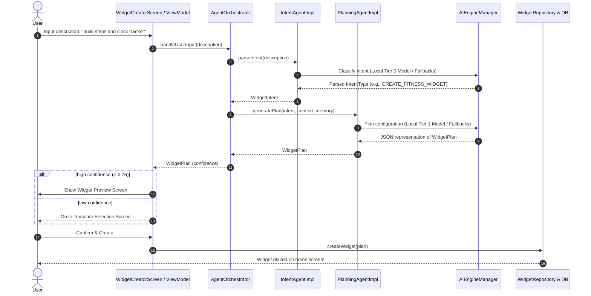
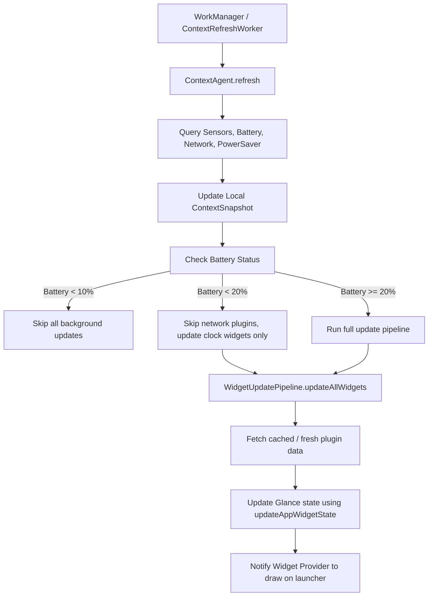

# MorphOS — Engineering Architecture Documentation

MorphOS is an AI-powered, adaptive Android widget platform designed to dynamically construct, schedule, and personalize Android AppWidgets using local and cloud AI models.

## Module Structure

The project follows a modular, feature-based Clean Architecture structure:

```
                  ┌──────────────┐
                  │    :app      │ (Application entry-point, Theme)
                  └──────┬───────┘
                         │
         ┌───────────────┼───────────────┬────────────────┐
         ▼               ▼               ▼                ▼
┌────────────────┐┌──────────────┐┌──────────────┐┌──────────────┐
│ :feature:dash..││ :feature:cre..││ :feature:set..││:feature:onb..│ (Feature modules)
└────────┬───────┘└──────┬───────┘└──────┬───────┘└──────┬───────┘
         │               │               │               │
         └───────────────┼───────────────┴───────────────┘
                         ▼
                ┌────────────────┐
                │  :core:widget  │ (Glance rendering, layouts & state)
                └────────┬───────┘
                         ▼
                ┌────────────────┐
                │    :core:ai    │ (LlamaCppEngine, OnnxEmbedding, Download)
                └────────┬───────┘
                         ▼
                ┌────────────────┐
                │   :core:data   │ (Room, DataStore, Repositories, Workers)
                └────────┬───────┘
                         ▼
                ┌────────────────┐
                │  :core:domain  │ (Entities, Use Cases, Agents, Interfaces)
                └────────┬───────┘
                         ▼
                ┌────────────────┐
                │  :core:common  │ (Dispatchers, Results, Utilities)
                └────────────────┘
```

---

## Architecture Flowcharts

### 1. Natural Language Widget Creation Flow



---

### 2. Adaptive Widget Update Loop (Context-Aware)



---

## Local AI Fallback System

In the event of network disconnection, model corruption, or engine load issues, MorphOS leverages a tiered fallback design:

1. **Tier 2 (Cloud AI)**: Used for complex intents/plans requiring remote LLM processing (if enabled in user settings).
   - *Fallback on failure / offload*: Queries Tier 1 local model.
2. **Tier 1 (Local Gemma-3 1B)**: Used for local widget planning.
   - *Fallback on failure / offload*: Uses pre-compiled deterministic rule-based planning mapping `IntentType` directly to standard templates.
3. **Tier 0 (Local SmolLM-135M)**: Used for lightning-fast local intent classification.
   - *Fallback on failure / offload*: Reverts to Regex/Keyword classification matching patterns like `"study"`, `"gym"`, `"weather"`.

---

## Security Hardening Details

- **Database Encryption**: MorphOS utilizes SQLCipher for encrypting the Room database. The passphrase is automatically generated as a secure 256-bit key, encrypted via Android KeyStore, and stored inside private SharedPreferences.
- **Network Security**: TLS-only traffic configuration (`cleartextTrafficPermitted="false"`) prevents MITM attacks.
- **Data Sanitization**: All user strings are scrubbed of HTML tags, JavaScript declarations, and formatting comment tokens (`' " # ; -- *`) to protect against prompt injections.
